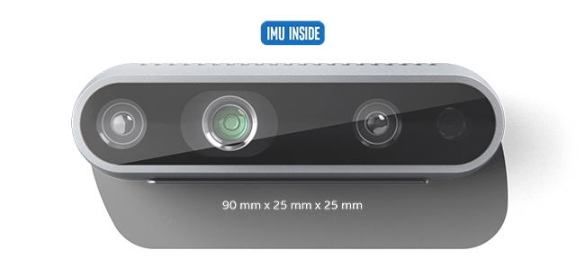
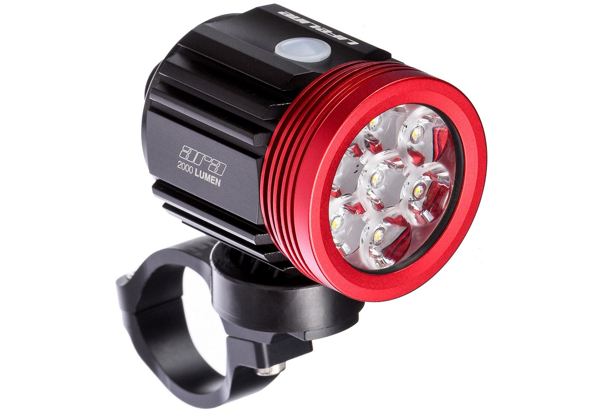

# Experiments and Datasets 

## Experiments

Equipment used:

- laptop
- camera: [Realsense D435i](https://www.intelrealsense.com/depth-camera-d435i/) - infrared stereo (640x480), hardware-synced IMU

- flashlight: [LifeLine Ara 2000L](https://www.chainreactioncycles.com/il/en/lifeline-ara-2000l-external-battery-front-light/rp-prod161246) - 2,000 Lumens


## Data Format

Data is stored in rosbags (.bag) containing next topics:
- /camera/imu 
- /camera/infra1/image_rect_raw/**compressed**
- /camera/infra2/image_rect_raw/**compressed**

When compressed you can use the next command:
```
rosrun image_transport republish compressed in:=/camera/infra1/image_rect_raw raw out:=/camera/infra1/image_rect_uc
```

## Recordings
- jan16/
    - 15 sequences
    - Calibration sequences with AprilTags and checkerboard needed for Kalibr
    - Static sequence for IMU calibration
    - Dynamic scenes inside apartment with varying degrees of motion
    - Dynamic scenes captured outdoors, some with large loops
- jan17_mono/
    - 7 sequences
    - Accidentally captured only 1 camera 
    - Contains sequences inside the room with low global light / flash 
    - Also measured illumination in lux
- jan17/
    - 19 sequences
    - Shaking/Moving/Walking at night with flashlight
    - *_diffused - with paper attached to the light
- jan18/
    - 17 sequences
    - Shaking/Moving/Walking at night with flashlight / diffuser
    - Have scenes with building - big, flat, textured, flat object

## Datasets

- [The UZH-FPV Drone Racing Dataset](http://rpg.ifi.uzh.ch/uzh-fpv.html)
- [FPV Drone Racing VIO](https://github.com/uzh-rpg/IROS2019-FPV-VIO-Competition)
- [Fast Flight Dataset](https://github.com/KumarRobotics/msckf_vio/wiki/dataset)
- [EuRoC MAV Dataset](https://projects.asl.ethz.ch/datasets/doku.php?id=kmavvisualinertialdatasets)

