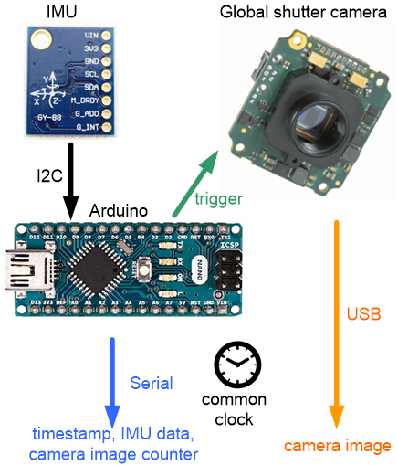
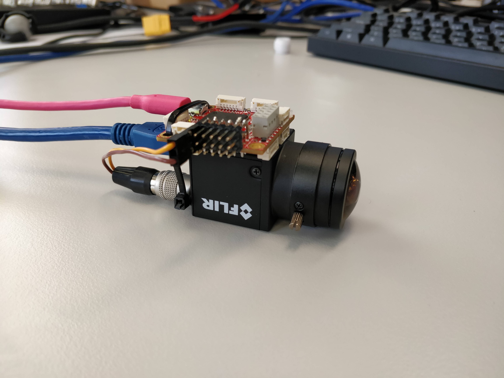

## TLDR:
For VIO to work properly it's important:  
- to have a global shutter camera
- use hardware synchronization via external trigger + MCU
- for good low-light performance: large, high-quality sensor 
- accurate IMU (we already have)

## To buy:
  - [Blackfly S USB3 camera](https://www.flir.com/products/blackfly-s-usb3?model=BFS-U3-04S2M-CS) $365 x2
  - [Focusafe 5Megapixel CS Mount Fisheye Lens 1/2" 1.55mm](https://www.aliexpress.com/item/32913271661.html?spm=a2g0s.9042311.0.0.31924c4d3DXq6y) $65 x2
  
## Links:

- [ROS camera and IMU synchronization](http://grauonline.de/wordpress/?page_id=1951)

- [MAV-tools: Visual Inertial Sensors](https://github.com/ethz-asl/mav_tools_public/wiki/Visual-Inertial-Sensors)

  - Visual-Inertial Sensing
  - Timestamp Accuracy
  - DIYing a VI-Sensor
  - Example Sensor

  

  - [wiki](https://github.com/ethz-asl/mav_tools_public/wiki) is also useful

- [External trigger for D435i: Using the RealSense D4xx Depth Sensors in Multi-Camera Configurations](https://simplecore.intel.com/realsensehub/wp-content/uploads/sites/63/Multiple_Camera_WhitePaper04.pdf)

