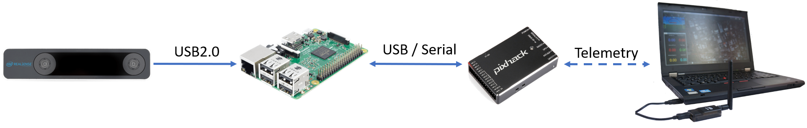

#### [GSoC 2019: Integration of ArduPilot and VIO tracking camera for GPS-less localization and navigation](https://discuss.ardupilot.org/t/gsoc-2019-integration-of-ardupilot-and-vio-tracking-camera-for-gps-less-localization-and-navigation/42394)

1. **Lab 1**: Indoor non-GPS flight using AprilTags ([ROS](http://wiki.ros.org/ROS/Introduction)-based)
2. **Lab 2**: Getting started with the [Intel Realsense T265](https://www.intelrealsense.com/tracking-camera-t265/) on Rasberry Pi using [librealsense](https://github.com/IntelRealSense/librealsense)and [ROS](http://wiki.ros.org/ROS/Introduction).
3. **Lab 3**: Indoor non-GPS flight using Intel T265 (ROS-based)
4. **Lab 4**: Autonomous indoor non-GPS flight using Intel T265 (ROS-based).
5. **Lab 5**: MAVLink bridge between Intel T265 and ArduPilot (non-ROS).
6. **Lab 6**: Calibration and camera orientation for vision positioning with Intel T265.

#### [PX4: Using Vision or Motion Capture Systems for Position Estimation](https://dev.px4.io/v1.9.0/en/ros/external_position_estimation.html)

- PX4 MAVLink Integration
- Reference Frames
- EKF2 tuning/configuration
- LPE tuning/configuration
- Working with ROS
- Setups

#### [Ardupilot: VIO tracking camera for Non-GPS Navigation](https://ardupilot.org/copter/docs/common-vio-tracking-camera.html)

- Hardware Requirements
- System Overview
- Installation / Configuration

#### [Github: vision_to_mavros](https://github.com/thien94/vision_to_mavros)

- All the code is here

#### [Auterion/VIO](https://github.com/Auterion/VIO)

- need to check - written in cpp